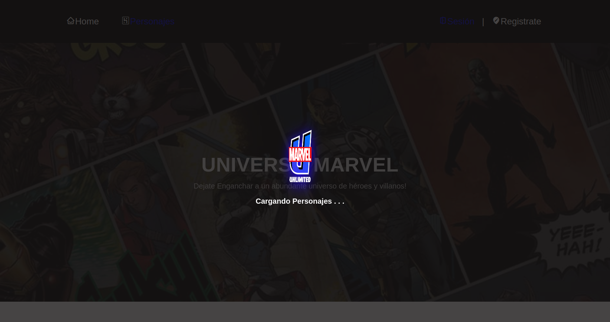
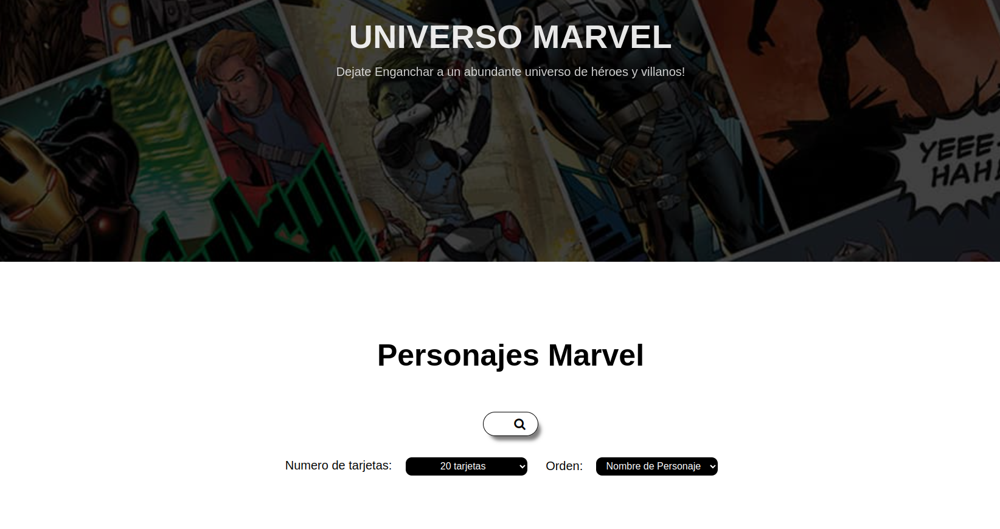
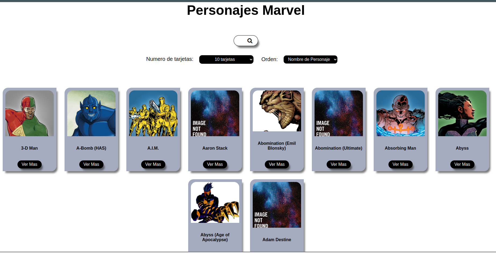
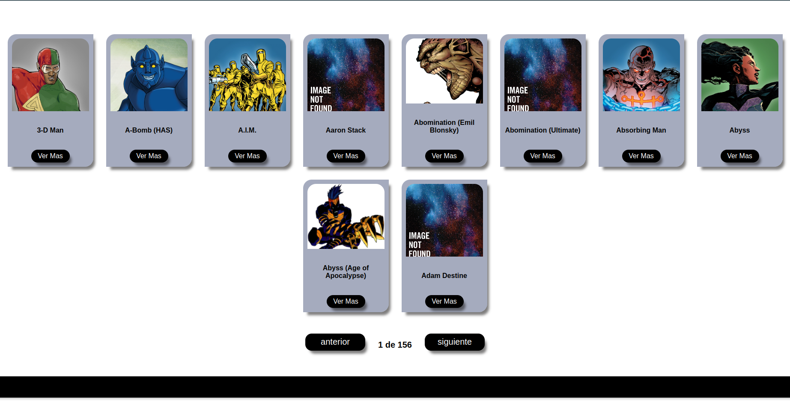

# Marvel API Web App

Este proyecto es una aplicación web desarrollada en equipo que consume el API de Marvel para mostrar información sobre personajes, series y cómics. La aplicación permite a los usuarios explorar los datos proporcionados por la API de manera interactiva y visual.

## Funcionalidades principales

- **Explorar Personajes**: Búsqueda, paginación y visualización detallada de personajes del universo Marvel.
- **Explorar Series**: Filtrar series por texto, años y personajes.
- **Explorar Cómics**: Navegar por cómics con filtros avanzados como años, personajes y creadores.

## Tecnologías utilizadas

- **Frontend**: HTML, CSS, JavaScript.
- **Backend**: API de Marvel para datos en tiempo real.
- **Herramientas**: Fetch API, manejo de eventos DOM, y promesas.

## Mi contribución

Trabajé en el desarrollo de la sección de **Personajes**, implementando las siguientes características:

1. **Conexión con la API**: Verifiqué la conectividad y realicé múltiples llamadas para obtener todos los personajes disponibles.
2. **Interfaz interactiva**: Desarrollé la lógica para la búsqueda, paginación y filtrado de personajes por nombre o ID.
3. **Panel de detalles**: Implementé una vista expandida para mostrar información adicional de cada personaje, incluyendo enlaces directos a su wiki y detalles oficiales.
4. **Ordenamiento dinámico**: Añadí opciones para ordenar a los personajes alfabéticamente o por ID.

## Instalación y uso

1. Clona el repositorio:
   ```bash
   git clone https://github.com/tu_usuario/marvel-api-webapp.git
   ```

## Capturas de pantalla

### Vista principal de personajes



### Pagina de inicio Personajes





## Licencia

Este proyecto utiliza los datos del API de Marvel bajo sus términos de uso.
